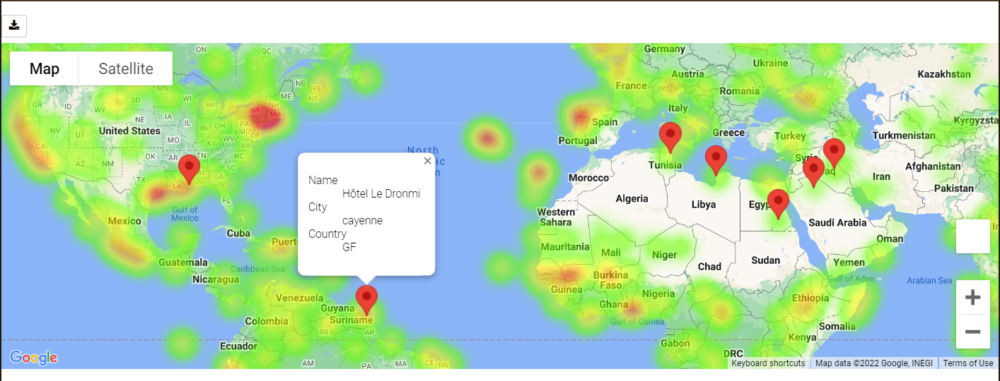

# Google Maps API & Weather API to Find Optimal Weather for a Holiday
## About this project

The goal of this project was to learn and utilize api's, to do this I wanted to find the optimal place for a holiday based upon weather conditions globally. To do this I had used the api's available from both google and open weather map. I also wanted to analyze the collected weather data as well as visualize my findings on an interactive map as shown below.

To do this I had created two python notebooks, 'WeatherAndAnalysis.ipynb' and 'GmapsForVacation.ipynb'. The first that needed to be ran was 'WeatherAndAnalysis.ipynb' as it collected a random set of 580 cities using a random city generator that then connects to the open weather map api and finds the: *latitude, longitude, Maximum Temperature for that day in °C, Humidity % Cloudiness %, Wind Speed, Country and Date of data collection*. From there I removed cities with too high humidity, performed some analysis on the data collected and exported the final dataframe to 'cities.csv'.

After I had used 'GmapsForVacation.ipynb' to import the 'cities.csv' and create a heatmap based upon the humidity of the selected cities on an interactive google map. Then I found cities that were cloudless and had a comfortable temperature range. With those selected cities (7 in total) I used google maps nearby search function to find lodging closest to the city center and placed pins on an interactive map showing the location of the lodging with the hotel name, city and country of each selected city.

## How to use these notebooks

The libraries necessary for operating both notebooks are:
- matplotlib
   - For data visualizations
- pandas
   - For handling large data frames
- numpy
   - To create the random city selection
- requests
   - Handling api requests
- time
   - For the Datetime
- scipy
   - For line regression analysis
- os
   - For outputting cities.csv
- Gmaps
   - for interactive mapping
- api_keys
   - This will need to be a locally made file with your personal API keys for both Google's API and Open Weathers API

To create the interactive maps locally simply run the GmapsForVacation.ipynb. Otherwise all data can be seen with any software that renders python notebooks.
